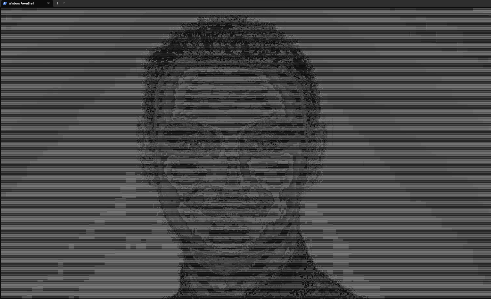

# ascii-art 

This command-line application allows users to effortlessly convert their favorite pictures and images into captivating
ASCII art, adding a creative twist to visual content.

## Features 🔍

- Convert images (jpg, jpeg, png) to ASCII art
- Easy-to-use command-line interface
- Fast and efficient conversion process
- Scalable for every screen and every size of image

## Tech stack 🔧

- [Java 17](https://adoptium.net/temurin/releases/) (temurin-17.0.6)

## Usage 🚀

Make sure you have Java 17 installed. Then, follow these steps to set up the ASCII Art Generator.

1. Download the latest JAR package from repository.
2. Run application using JAR file and passing the path to image (jpg, jpeg, png) as an argument:

```bash
java -jar ascii-art-1.x.x.jar path_to_image.jpg
```

3. After executing, zoom out terminal as most as possible and maximize the window. You'll see the ascii art.

## License 🔱

This project is licensed under the MIT License.

## Acknowledgements 👏

I would like to express my gratitude to the following individuals and projects that inspired and guided me in creating
this ASCII Art Generator:

- [Robert Heaton](https://twitter.com/RobJHeaton) - your contribution have been invaluable, and I am thankful for
  the [guidance](https://robertheaton.com/2018/06/12/programming-projects-for-advanced-beginners-ascii-art/) and
  inspiration that drove the development of this project.

If you find this project useful or have any feedback, please don't hesitate to get in touch!

---

Give your terminal a creative touch with ASCII Art Generator! Share your own masterpieces and spread the love for ASCII
art.

For inquiries and collaborations, please contact [milgodyn@outlook.com](mailto:milgodyn@outlook.com).