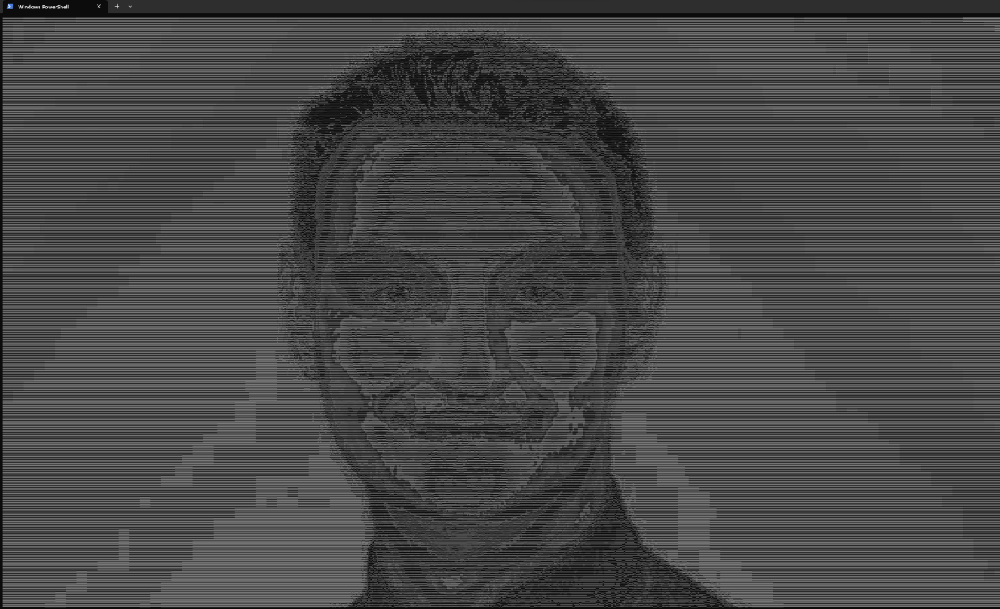

# ascii-art [](https://github.com/m-godyn/ascii-art/actions/workflows/maven_buildAndTest.yml)

This command-line application allows users to effortlessly convert their favorite pictures and images into captivating
ASCII art, adding a creative twist to visual content.

## Features 🔍

- Convert images (jpg, jpeg, png) to ASCII art
- Easy-to-use command-line interface
- Fast and efficient conversion process
- Scalable for every screen and every size of image

## Tech stack 🔧

- [Java 17](https://adoptium.net/temurin/releases/)
- Maven

## Build and test 🛠️

Make sure Java 17 and Maven are installed, then run:

```bash
mvn --batch-mode clean verify
```

## Usage 🚀

Build the application, then pass a JPG, JPEG or PNG image to the generated executable JAR:

```bash
mvn --batch-mode clean package
java -jar target/ascii-art-1.0.2-SNAPSHOT.jar path/to/image.jpg
```

For the most readable output, use a large terminal window and reduce the terminal font size when processing larger images.

## License 🔱

This project is licensed under the MIT License.

## Acknowledgements 👏

I would like to express my gratitude to the following individuals and projects that inspired and guided me in creating
this ASCII Art Generator:

- [Robert Heaton](https://twitter.com/RobJHeaton) - your contribution have been invaluable, and I am thankful for
  the [guidance](https://robertheaton.com/2018/06/12/programming-projects-for-advanced-beginners-ascii-art/) and
  inspiration that drove the development of this project.

If you find this project useful or have any feedback, please don't hesitate to get in touch!

---

Give your terminal a creative touch with ASCII Art Generator! Share your own masterpieces and spread the love for ASCII
art.

For inquiries and collaborations, please contact [milgodyn@outlook.com](mailto:milgodyn@outlook.com).
